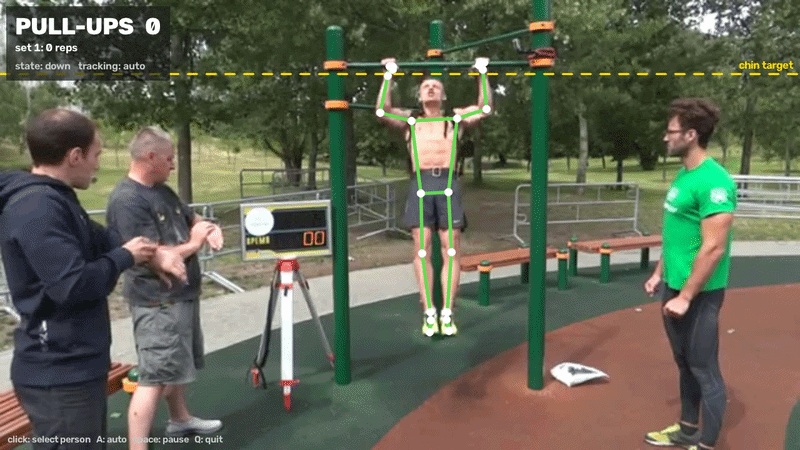

# spotter

your spotter at the gym watches your form and counts for you. this does the same from a video. pull-ups for now, push-ups next.



## why i made this

a friend of mine sent me a video of him doing push-ups and asked me to review his form. i watched it like 3 times trying to count the reps and see where he was cheating and thought ok a program could just do this.

so i built it, starting with pull-ups. it counts the reps, checks every single one, and shows when you start getting tired. the plan is to cover more exercises over time, push-ups next.

## what it does

- finds the person on the bar, even with people standing around. you can also click on someone to track only them
- counts a rep only when the arms go straight at the bottom and the nose gets above the bar. dropping off the bar at the end doesn't add fake reps
- checks form on every rep:
  - full extension at the bottom
  - chin over the bar
  - swinging / kipping
  - one arm pulling more than the other
- times each rep (up and down) and shows fatigue, like how much slower your last pulls are compared to the first ones
- splits the video into sets when you take a break (5s+ off the bar)
- can save the annotated video

## how it works

MediaPipe gives 33 body points per frame. from those:

- the bar height comes from the wrists during the first dead hang (the yellow "chin target" line). it gets measured again after every break in case the camera moved
- a rep is a small state machine: `down` (hanging, arms straight) → `up` (nose above the bar). `off` means the hands aren't on the bar so nothing counts
- form checks use elbow angles, where the mouth is compared to the bar and how much the hips move sideways
- thresholds (150°, 160°, 25° etc.) were picked by testing on videos, so they're not perfect yet

the counting logic is in `counter.py` and doesn't touch the camera at all, that's why it can be tested with fake skeletons in `test_counter.py`.

## setup

tested on python 3.12

```sh
python -m venv .venv
.venv\Scripts\activate
pip install -r requirements.txt
curl -L -o pose_landmarker_lite.task https://storage.googleapis.com/mediapipe-models/pose_landmarker/pose_landmarker_lite/float16/latest/pose_landmarker_lite.task
```

## run

```sh
python main.py                                         # webcam
python main.py --source clip.mp4                       # video
python main.py --source clip.mp4 --output result.mp4   # save the annotated video
pytest
```

while it's running:

| key | |
|---|---|
| click | track only that person |
| `A` | back to auto tracking |
| `space` | pause |
| `Q` | quit |

film from the front with the bar and your whole body in the frame, it works way worse from the side.

## todo

- push-ups (the whole reason this exists lol)
- test it on more videos and tune the form thresholds
- web app where you upload a video and see your history

## license

MIT, see [LICENSE](LICENSE).
